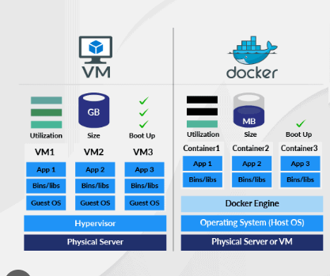

# Container 를 사용하는 이유

Virtual Machine으로 알려져 있는 Virtual box와는 다르게 Container는 OS를 가상화해서 여러개의 컨테이너를 OS 커널 위에서 실행시킬 수 있습니다. 

다음 그림과 같이 

OS kerner 위에서 구동시키게 되면, 이미지 크기가 작아지고 부팅속도가 빨라집니다. 이 뿐 아니라, 각 서비스의 환경을 분리할 수 있습니다. 

container가 존재하기 전에는 dependency 충돌이 잦았습니다. 
추가로, 배포할 때 guideline이 필요했습니다. 

# Container 란? 

맥북, PC, Linux, Cloud, Datacenter 어디에서든 실행할 수 있는 소프트웨어 패키지입니다. 

컨테이너화를 통해 효율적으로 소프트웨어를 배포할 수 있고,