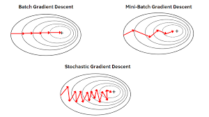

## Introduction

딥러닝 모델을 학습시킬 때 가장 중요한 목표는 **비용함수** 를 최소화하는 것이다.
이걸 위해 우리는 매 iteration 마다 모델의 파라미터를 조금씩 수정하는데, 그 과정을 담당하는 것이 경사하강법이다.

하지만 경사하강법은 하나의 방식만 있는 것은 아니다.
데이터를 얼마나 나눠서 처리하냐에 따라 다양한 방법이 존재한다.

이번 글에서는 경사하강법의 세가지 대표적인 방식인 **Batch Gradient Descent (GD), Stochastic Gradient Descent (SGD), Mini-batch Gradient Descent** 이 세 가지를 비교해보고, 각각의 특징과 장단점을 차근차근 알아볼 거다.

## GD vs SGD vs Mini-batch GD: 개념



### Batch Gradient Descent

- **정의**: 전체 학습 데이터를 한 번에 모두 사용해 파라미터를 업데이트합니다.
- **업데이트 횟수**는 적지만, 한 번의 계산에 **비용이 큽니다**.
- **구현 방식 요약**:
  ```python
  for i in range(num_iterations):
      AL, caches = forward_propagation(X, parameters)
      grads = backward_propagation(AL, Y, caches)
      parameters = update_parameters(parameters, grads)
  ```

### Stochastic Gradient Descent

- **정의**: 한 번에 딱 하나의 훈련 예제만 사용해서 파라미터를 업데이트합니다.
- 굉장히 자주 업데이트하지만, **방향이 자주 흔들립니다.**
- **구현 방식 요약**:
  ```python
  for i in range(num_iterations):
      for j in range(m):  # m = number of training examples
          x_j = X[:, j].reshape(-1, 1)
          y_j = Y[:, j].reshape(1, 1)
          AL, caches = forward_propagation(x_j, parameters)
          grads = backward_propagation(AL, y_j, caches)
          parameters = update_parameters(parameters, grads)
  ```

### Mini-Batch Gradient Descent

- **정의**: 데이터를 일정 크기의 묶음(mini-batch)으로 나누어 학습합니다.  
  예: 한 번에 32개, 64개씩 사용
- **속도와 안정성의 균형**이 가장 잘 잡힌 방식입니다.
- **구현 방식 요약**:

  ```python
  def random_mini_batches(X, Y, mini_batch_size=64, seed=0):
    np.random.seed(seed)
    m = X.shape[1]  # 총 샘플 수
    mini_batches = []

    # Step 1: 데이터 섞기
    permutation = list(np.random.permutation(m))
    shuffled_X = X[:, permutation]
    shuffled_Y = Y[:, permutation].reshape(Y.shape[0], m)

    # Step 2: 미니배치로 나누기
    num_complete_minibatches = m // mini_batch_size
    for k in range(num_complete_minibatches):
        mini_batch_X = shuffled_X[:, k * mini_batch_size : (k + 1) * mini_batch_size]
        mini_batch_Y = shuffled_Y[:, k * mini_batch_size : (k + 1) * mini_batch_size]
        mini_batches.append((mini_batch_X, mini_batch_Y))

    # 남은 샘플 처리 (미니배치 크기로 나눠떨어지지 않을 경우)
    if m % mini_batch_size != 0:
        mini_batch_X = shuffled_X[:, num_complete_minibatches * mini_batch_size :]
        mini_batch_Y = shuffled_Y[:, num_complete_minibatches * mini_batch_size :]
        mini_batches.append((mini_batch_X, mini_batch_Y))

    return mini_batches

  mini_batches = random_mini_batches(X, Y, mini_batch_size=64)

  for i in range(num_iterations):
      for mini_batch in mini_batches:
          (mini_batch_X, mini_batch_Y) = mini_batch
          AL, caches = forward_propagation(mini_batch_X, parameters)
          grads = backward_propagation(AL, mini_batch_Y, caches)
          parameters = update_parameters(parameters, grads)
  ```

#### ❓ 왜 mini-batch 크기를 2의 거듭제곱(예: 32, 64, 128 등)으로 자를까?

이는 하드웨어, 특히 GPU/TPU에서의 병렬 처리 최적화 때문입니다.
2의 거듭제곱 크기는 메모리 정렬 및 연산 단위와 잘 맞기 때문에,
• 계산이 더 빠르고
• 메모리 접근 속도도 향상됨

따라서 많은 딥러닝 프레임워크(PyTorch, TensorFlow 등)에서도 기본적으로 batch_size=32 혹은 64를 추천합니다.

#### ⚖️ mini-batch 크기의 트레이드오프

❗ 너무 작으면?
• 매 업데이트마다 사용하는 데이터가 적어서 gradient(기울기)의 방향이 흔들림
• 이걸 진동(oscillation) 이라고 부르는데,
모델이 일정한 방향으로 잘 수렴하지 못하고 왔다 갔다 할 수 있음

❗ 너무 크면?
• GD와 다를 바 없이 전체 데이터에 가까워짐
• 업데이트가 너무 느려지고, 속도 이점이 줄어듦
• 자주 업데이트하지 못하니 빠르게 최적점을 찾기 어려움

## Momentum

Mini-batch Gradient Descent는 전체 데이터셋을 사용하지 않고 일부 데이터만으로 파라미터를 업데이트하기 때문에,  
Gradient(기울기)의 방향이 **일정하지 않고 진동**하는 현상이 발생할 수 있습니다.

이러한 진동은 모델이 **최솟값에 빠르게 도달하지 못하고**,  
오히려 최솟값 주변을 왔다 갔다 하게 만들 수 있습니다.

이를 해결하기 위한 대표적인 기법이 바로 **Momentum**입니다.

Momentum(모멘텀)은 **이전 단계의 Gradient 방향을 기억하여**,  
현재의 Gradient와 **결합된 방향**으로 파라미터를 업데이트하는 방법입니다.

마치 **경사면을 내려가는 공**이 이전에 얻은 **속도(방향 + 크기)** 를 그대로 유지하며 점점 가속도 붙여서 내려오는 것과 비슷합니다.

\[
v = \beta \cdot v + (1 - \beta) \cdot \nabla J
\]
\[
\theta = \theta - \alpha \cdot v
\]

- \( v \): 이전 단계까지의 누적된 Gradient (속도)
- \( \beta \): 모멘텀 계수 (보통 0.9)
- \( \nabla J \): 현재의 Gradient
- \( \alpha \): 학습률 (learning rate)

```python
def update_parameters_with_momentum(parameters, grads, v, beta, learning_rate):
    """
    Momentum을 적용하여 파라미터를 업데이트합니다.

    Arguments:
    parameters -- 딥러닝 모델의 파라미터 (W, b 등)
    grads -- 각 파라미터에 대한 그래디언트
    v -- 이전 단계까지의 속도(누적된 그래디언트 평균)
    beta -- 모멘텀 계수 (보통 0.9)
    learning_rate -- 학습률

    Returns:
    parameters -- 업데이트된 파라미터
    v -- 업데이트된 속도 벡터
    """
    L = len(parameters) // 2  # 레이어 수

    for l in range(1, L + 1):
        # 1. 속도 업데이트: 이전 속도와 현재 그래디언트의 결합
        v["dW" + str(l)] = beta * v["dW" + str(l)] + (1 - beta) * grads["dW" + str(l)]
        v["db" + str(l)] = beta * v["db" + str(l)] + (1 - beta) * grads["db" + str(l)]

        # 2. 파라미터 업데이트: 속도를 반영하여 파라미터 이동
        parameters["W" + str(l)] -= learning_rate * v["dW" + str(l)]
        parameters["b" + str(l)] -= learning_rate * v["db" + str(l)]

    return parameters, v
```

#### 모멘텀 계수 β의 역할

- β = 0이면 일반적인 Gradient Descent와 동일해집니다.
- β가 1에 가까울수록 과거 방향을 더 많이 반영하여 진동이 줄어들고 부드러운 수렴이 가능합니다.
- 일반적으로는 β = 0.9를 가장 많이 사용합니다.

## Adam Optimizer: Momentum과 RMSProp의 만남

딥러닝에서 가장 널리 쓰이는 최적화 알고리즘 중 하나가 바로 **Adam(Adaptive Moment Estimation)** 입니다.  
Adam은 지금까지 배운 두 가지 기법을 동시에 사용합니다:

1. **Momentum** → 과거의 기울기 방향을 반영
2. **RMSProp** → 기울기의 크기에 따라 학습률을 자동 조절

즉,

> **방향은 모멘텀처럼 잡고, 속도는 RMSProp처럼 조절한다**

### 수식

Adam은 다음과 같은 수식을 따릅니다 (레이어 \( l \)):

\[
\begin{aligned}
v*{dW^{[l]}} &= \beta_1 \cdot v*{dW^{[l]}} + (1 - \beta*1) \cdot \frac{\partial J}{\partial W^{[l]}} \\
v^{\text{corrected}}*{dW^{[l]}} &= \frac{v*{dW^{[l]}}}{1 - \beta_1^t} \\[10pt]
s*{dW^{[l]}} &= \beta*2 \cdot s*{dW^{[l]}} + (1 - \beta*2) \cdot \left( \frac{\partial J}{\partial W^{[l]}} \right)^2 \\
s^{\text{corrected}}*{dW^{[l]}} &= \frac{s*{dW^{[l]}}}{1 - \beta_2^t} \\[10pt]
W^{[l]} &= W^{[l]} - \alpha \cdot \frac{v^{\text{corrected}}*{dW^{[l]}}}{\sqrt{s^{\text{corrected}}\_{dW^{[l]}}} + \varepsilon}
\end{aligned}
\]

- \( v \): 1차 모멘트(=기울기의 평균)
- \( s \): 2차 모멘트(=기울기의 제곱 평균)
- \( \beta_1, \beta_2 \): 각각 1차, 2차 모멘트의 지수평균 계수 (보통 0.9, 0.999)
- \( t \): 현재 반복 횟수
- \( \varepsilon \): 0으로 나누는 것을 방지하는 작은 수 (보통 \( 10^{-8} \))

### 🧠 왜 Adam이 강력한가요?

| 요소               | 설명                                                                        |
| ------------------ | --------------------------------------------------------------------------- |
| **빠른 수렴 속도** | 모멘텀 덕분에 빠르게 전진할 수 있습니다.                                    |
| **진동 억제**      | RMSProp의 제곱 평균 덕분에 방향이 흔들리지 않습니다.                        |
| **튜닝이 쉬움**    | 기본값만으로도 좋은 성능을 내는 경우가 많습니다.                            |
| **실무 적용성**    | 다양한 문제에 두루 쓰이며, 딥러닝 프레임워크의 기본 Optimizer로 사용됩니다. |

### Adam 코드 구현 예시

아래는 파라미터를 Adam 방식으로 업데이트하는 코드 예시입니다:

```python
def update_parameters_with_adam(parameters, grads, v, s, t, learning_rate=0.01,
                                beta1=0.9, beta2=0.999, epsilon=1e-8):
    L = len(parameters) // 2
    v_corrected = {}
    s_corrected = {}

    for l in range(1, L + 1):
        # 1. Moving average of the gradients
        v["dW" + str(l)] = beta1 * v["dW" + str(l)] + (1 - beta1) * grads["dW" + str(l)]
        v["db" + str(l)] = beta1 * v["db" + str(l)] + (1 - beta1) * grads["db" + str(l)]

        # 2. Bias correction
        v_corrected["dW" + str(l)] = v["dW" + str(l)] / (1 - beta1 ** t)
        v_corrected["db" + str(l)] = v["db" + str(l)] / (1 - beta1 ** t)

        # 3. Moving average of the squared gradients
        s["dW" + str(l)] = beta2 * s["dW" + str(l)] + (1 - beta2) * (grads["dW" + str(l)] ** 2)
        s["db" + str(l)] = beta2 * s["db" + str(l)] + (1 - beta2) * (grads["db" + str(l)] ** 2)

        # 4. Bias correction
        s_corrected["dW" + str(l)] = s["dW" + str(l)] / (1 - beta2 ** t)
        s_corrected["db" + str(l)] = s["db" + str(l)] / (1 - beta2 ** t)

        # 5. Parameter update
        parameters["W" + str(l)] -= learning_rate * (
            v_corrected["dW" + str(l)] / (np.sqrt(s_corrected["dW" + str(l)]) + epsilon)
        )
        parameters["b" + str(l)] -= learning_rate * (
            v_corrected["db" + str(l)] / (np.sqrt(s_corrected["db" + str(l)]) + epsilon)
        )

    return parameters, v, s
```

### ❓ Bias Correction이 왜 필요할까?

Adam은 **기울기의 지수 가중 평균**을 사용하는데,  
이 지수 평균은 **초기값이 0**으로 시작하기 때문에 학습 초기에 **값이 작게 나오는 편향(bias)** 이 생깁니다.

예를 들어, 모멘텀의 누적 평균 \( v \)를 보면:

\[
v = \beta_1 \cdot v + (1 - \beta_1) \cdot g
\quad \text{(여기서 } g \text{는 현재 그래디언트)}
\]

처음 몇 번은 \( v \)가 0에 가까운 상태에서 출발하기 때문에  
실제 그래디언트의 평균보다 **과소 추정**하게 됩니다.

---

### 🔍 예시로 이해해보기

- \( \beta_1 = 0.9 \), \( t = 1 \)일 때:
  \[
  v = 0.9 \cdot 0 + 0.1 \cdot g = 0.1g
  \]
- 단 1번만 업데이트했는데, 실제 기울기보다 **10배 작게 반영**되는 것이죠.

---

### ✅ 해결 방법: Bias Correction

이를 해결하기 위해 Adam은 **bias correction(편향 보정)** 을 적용합니다.

\[
v^{\text{corrected}} = \frac{v}{1 - \beta_1^t}
\]

이 보정식을 통해 초기에 0에서 시작하더라도  
**실제 기대값에 가까운 평균값**으로 보정해줄 수 있습니다.

같은 방식으로, 제곱 평균을 저장하는 \( s \)에도 보정을 적용합니다:

\[
s^{\text{corrected}} = \frac{s}{1 - \beta_2^t}
\]

## Learning Rate Decay와 스케줄링

모델이 학습을 잘 하려면 **학습률(learning rate)** 설정이 매우 중요합니다.  
처음에는 크게 움직이며 빠르게 최적값에 접근하고,  
나중에는 조심스럽게 수렴해야 하죠.

이런 흐름을 구현하는 것이 바로 **Learning Rate Decay** 또는 **스케줄링(scheduling)** 입니다.

---

### 🔽 Learning Rate Decay란?

학습이 진행될수록 학습률을 **점점 줄여나가는 기법**입니다.

- 초반에는 빠르게 움직이다가
- 점점 더 **작은 보폭으로 미세 조정**하게 됩니다.

예시:  
\[
\alpha_t = \frac{\alpha_0}{1 + decay \cdot t}
\]

- \( \alpha_0 \): 초기 학습률
- \( t \): 현재 epoch 또는 step
- `decay`: 감소 계수

---

### 🗓️ Scheduling이란?

학습률을 **사전에 정의한 규칙에 따라 조정하는 방법**입니다.

예를 들어:

- **Step Decay**: 일정 epoch마다 학습률을 절반으로 줄이기
- **Exponential Decay**: 매 epoch마다 일정 비율로 감소
- **Reduce on Plateau**: 성능이 개선되지 않을 때만 학습률 감소

---

### ✅ 정리

| 방식                | 특징                                          |
| ------------------- | --------------------------------------------- |
| Learning Rate Decay | 전체 학습 흐름에 따라 점진적으로 감소         |
| Scheduling          | 사전 규칙 또는 성능 변화에 따라 동적으로 조정 |

이 기법들은 대부분의 프레임워크에서 간단하게 적용 가능하며,  
**더 빠른 수렴과 안정적인 최적화**에 도움을 줄 수 있습니다.
