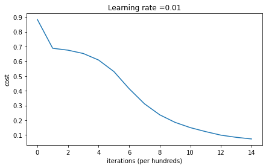

## Introduction

딥 러닝 모델을 만들 때 우리는 뉴런의 수, 레이어의 갯수, 활성함수 등에 초점을 맞춥니다.
하지만 실제로는 그보다 더 작은 세밀한 설정들이 학습속도에 영향을 미칩니다.

이 글에서는 딥러닝에서 중요한 3가지 테크닉인 다음을 정리하려고 합니다.

1. initialization (초기화)
2. Regularization (정규화)
3. Gradient Checking

## Initialization

신경망 학습에서 가중치를 어떻게 초기화하냐에 따라 학습속도와 성능에 큰 영향을 끼칩니다.
초기화가 잘못되면 학습이 안되거나, 매우 느리게 수렴될 수 있습니다.

### Zero Initialization

```python
W1 = np.zeros((layer_size, input_size))
```

모든 가중치를 0으로 초기화하는 것입니다. 이 방식의 핵심문제는 대칭성을 깨지못한다는 점입니다. (symmetric breaking)
즉 모든 뉴련이 똑같은 역할만 학습하므로 모델이 전혀 학습하지 못합니다.


### Random Initialization

```python
W1 = np.random.randn(layer_size, input_size) * scale
```


scale이 너무 큰 값을 가지게 되면 각 층을 지날수록 출력값이 계속 커져서 역전파 중 기울기가 기하급수적으로 커질 수 있습니다. (`exploding gradients`)
반대로, scale이 너무 작은 값을 가지게 되면, 출력값이 매우 작아지고 활성화함수(sigmoid,tanh) 를 거치게 되면 평평한 영역에 머물게 됩니다. 그렇게 됨으로써 gradient는 점점 0에 가까워지므로 기울기 0으로 수렴할 수 있습니다. (`vanishing gradient`)

### He Initialization (Xavier Initialization)

Relu를 사용하는 신경망에서 유용한 초기화 방법은 각 층의 출력값 분산이 일정하게 유지되도록 하는 방법인 He Initialization 을 사용할 수 있습니다.

```python
W = np.random.randn(layer_size, prev_layer_size) * np.sqrt(2. / prev_layer_size)
```



#### 🔍 He Initialization의 수학적 직관: 왜 \(\frac{2}{n^{[l-1]}}\)인가?

---

#### 1️⃣ 목표: 분산 유지

딥러닝에서 각 층을 통과할 때, **출력값의 분산이 입력값의 분산과 비슷하게 유지되는 것**이 중요합니다.

왜냐하면:

- 분산이 계속 커지면 → **Exploding Activations**
- 분산이 계속 작아지면 → **Vanishing Activations**

이 현상은 결국 **gradient exploding/vanishing** 문제로 이어지며, 학습을 어렵게 만듭니다.

---

#### 2️⃣ ReLU 이전: 선형 계산

딥러닝에서 한 층의 선형 계산은 다음과 같습니다:

\[
z^{[l]} = W^{[l]} a^{[l-1]} + b^{[l]}
\]

이 때, 편향 \( b \) 는 분산에 큰 영향을 주지 않으므로 생략하고,  
\( z^{[l]} \) 의 분산을 구해보면:

\[
\text{Var}(z^{[l]}) = n^{[l-1]} \cdot \text{Var}(W^{[l]}) \cdot \text{Var}(a^{[l-1]})
\]

> 👉 즉, 가중치가 커지면 \( z \) 의 분산도 커지고, 뉴런 수가 많아도 분산이 증가합니다.

---

#### 3️⃣ ReLU 통과 후: 비선형 함수의 영향

ReLU 함수는 음수를 모두 0으로 만들어버립니다:

\[
\text{ReLU}(z) = \max(0, z)
\]

ReLU를 통과시키면:

- 입력의 **절반 정도가 0**이 되므로
- 분산은 **약 절반으로 줄어듭니다**

\[
\text{Var}(a^{[l]}) = \frac{1}{2} \cdot \text{Var}(z^{[l]})
\]

---

#### 4️⃣ 분산을 유지하려면?

이제 두 단계를 합치면 다음과 같은 식이 나옵니다:

\[
\text{Var}(a^{[l]}) = \frac{1}{2} \cdot n^{[l-1]} \cdot \text{Var}(W^{[l]}) \cdot \text{Var}(a^{[l-1]})
\]

우리는 다음을 유지하고 싶습니다:

\[
\text{Var}(a^{[l]}) = \text{Var}(a^{[l-1]})
\]

따라서 위 식을 정리하면:

\[
\frac{1}{2} \cdot n^{[l-1]} \cdot \text{Var}(W^{[l]}) = 1
\]

최종적으로:

\[
\text{Var}(W^{[l]}) = \frac{2}{n^{[l-1]}}
\]

---

#### ✅ 결론: He Initialization

He Initialization은 ReLU의 분산 감소 효과를 고려하여 가중치의 분산을 다음과 같이 설정합니다:

$$
W^{[l]} \sim \mathcal{N}\left(0, \frac{2}{n^{[l-1]}} \right)
$$

## Regularization

모델이 훈련데이터에 아주 잘 맞게 훈련되면 과적합(overfitting)이 발생합니다.
overfitting 된 모델은 training data에는 성능이 뛰어나지만 새로운 데이터에서는 성능이 떨어집니다.
이런 문제를 해결하기 위해 정규화를 사용합니다.

### L2 Regularization

**L2 Regularization**은 신경망의 비용함수에 가중치의 제곱합을 추가하여 가중치가 너무 커지지 않도록 패널티를 주는 방법입니다.


기존의 이진 분류 손실 함수 (Cross-Entropy Loss):

$$
J = -\frac{1}{m} \sum_{i=1}^m \left[ y^{(i)} \log(a^{[L](i)}) + (1 - y^{(i)}) \log(1 - a^{[L](i)}) \right]
$$

정규화를 추가하면,

$$
J_{\text{regularized}} = J + \frac{\lambda}{2m} \sum_{l=1}^{L} \| W^{[l]} \|_F^2
$$

- \( \lambda \): 정규화 강도를 조절하는 하이퍼파라미터
- \( \| W^{[l]} \|\_F^2 \): 층 \( l \)의 가중치 행렬에 대한 Frobenius norm 제곱 (즉, 제곱합)

```python
# 기존의 Cross-Entropy cost
cross_entropy_cost = compute_cost(A3, Y)

# L2 Regularization term
L2_regularization_cost = (lambd / (2 * m)) * (
    np.sum(np.square(W1)) +
    np.sum(np.square(W2)) +
    np.sum(np.square(W3))
)

# Regularized cost
cost = cross_entropy_cost + L2_regularization_cost
```

#### 정규화를 적용하면

- 과적합 방지
  (훈련 데이터에 과하게 맞추지 않도록 억제)
- Weight Decay
  (모든 가중치가 더 작아짐)
- 매끄러운 결정 경계
  → 더 좋은 일반화 성능 (test accuracy 향상)

## dropout

**dropout**은 학습중에 무작위로 뉴런을 끄는 학습 기법입니다.
→ 특정 뉴런이 다른 뉴런에 **과도하게 의존** 하는 것을 방지합니다.
→ **더 강건한(redundant)** 특징 표현을 학습하게 만들어줍니다.

### 어떻게 작동할까?

학습 중 **매 iteration마다** 다음을 수행:

1. 은닉층의 각 뉴런에 대해 확률 \( p \) 로 **살려두고**
2. 확률 \( 1 - p \) 로 **꺼버립니다 (출력을 0으로 만듦)**
3. 살아남은 뉴런들의 출력을 \( \frac{1}{p} \) 로 나눠 스케일 보정

> 이 방식은 **inverted dropout**이라고 하며,  
> 예측 시에는 dropout 없이도 평균적인 출력값이 유지됩니다.

### 수식 표현

Dropout 마스크 \( D^{[l]} \)를 생성:

$$
D^{[l]} = \text{Bernoulli}(p)
$$

은닉층 출력 \( A^{[l]} \)를 마스킹:

$$
A^{[l]} = A^{[l]} \cdot D^{[l]}
$$

스케일 보정:

$$
A^{[l]} = \frac{A^{[l]}}{p}
$$

### 🧑‍💻 코드 예시 (Python + NumPy)

```python
# Forward propagation with dropout
Z1 = np.dot(W1, X) + b1
A1 = relu(Z1)

# Step 1: dropout mask 생성 (keep_prob = 0.8이면 80% 살려둠)
D1 = (np.random.rand(*A1.shape) < keep_prob).astype(int)

# Step 2: 마스크 적용
A1 = A1 * D1

# Step 3: 스케일 보정
A1 = A1 / keep_prob
```

### dropout의 효과

- 과적합 방지
  → 모델이 특정 feature에만 의존하지 않고, 더 일반적인 패턴을 학습하게 됨
- 강건한 표현 학습
  → 일부 뉴런이 꺼져도 전체 성능이 유지되는 모델
- 앙상블 효과
  → 매번 다른 서브 네트워크를 학습하는 효과 → test 시간엔 평균 내는 느낌



Dropout은 학습 중 일부 뉴런의 출력을 **0으로 꺼서 과적합을 방지**하는 기법입니다.  
하지만 이렇게 하면 **출력의 평균값이 줄어드는 문제**가 발생합니다.

예를 들어, `keep_prob = 0.8`인 경우,  
출력의 기대값은 원래보다 20% 감소합니다:

$$
\mathbb{E}[\tilde{a}] = p \cdot a = 0.8 \cdot a
$$

이를 보완하기 위해 Dropout에서는 **살아남은 뉴런의 출력을 \( \frac{1}{p} \)로 나눠줍니다**:

$$
\tilde{a}_{\text{scaled}} = \frac{\tilde{a}}{p}
$$

이렇게 하면 출력의 기대값이 원래 값과 같아집니다:

$$
\mathbb{E}\left[\frac{\tilde{a}}{p}\right] = a
$$

✅ 이를 **Inverted Dropout**이라고 하며,  
**학습과 테스트 간 분포를 맞추기 위한 핵심적인 보정**입니다.



## Gradient Checking

---

### 왜 필요한가?

신경망의 학습은 **역전파(backpropagation)** 로 이루어집니다.  
하지만 역전파 구현은 복잡하기 때문에,  
**실수 없이 정확히 작동하는지 확인**이 필요합니다.

---

### 아이디어

비용 함수 \( J(\theta) \)에 대해,  
매우 작은 \( \varepsilon \)을 사용하여 수치적으로 미분합니다:

$$
\frac{\partial J}{\partial \theta} \approx \frac{J(\theta + \varepsilon) - J(\theta - \varepsilon)}{2 \varepsilon}
$$

이를 **backprop으로 계산한 미분 값과 비교**합니다.

---

### 코드 개요 (간단 예시)

```python
grad_approx = (J(theta + eps) - J(theta - eps)) / (2 * eps)
difference = np.linalg.norm(grad - grad_approx) / (np.linalg.norm(grad) + np.linalg.norm(grad_approx))
```
