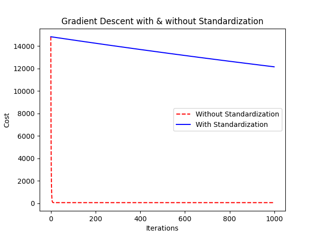

## Intro

logistic regression 이 neural network의 기초라고 하는데
"왜 단순한 회귀 모델이 신경망과 연결될까?" / "표준화는 왜 해야하고, 강사하강법은 어떻게 동작하는 것일까?"

이번 글에서는 위 질문의 답을 찾기 위해 Logistic Regression 을 구현하며 얻은 인사이트를 정리하고자 한다.

## Logistic Regression with neural network mindset

### preprocessing

1. Figure out the dimensions and shape of problem dataset
2. Reshape dataset
3. Standardize / Normalize dataset

데이터를 전처리하는 과정에서, 이미지의 경우 (height, width, channel) 이렇게 들어오는데, 이러한 데이터를 (height _ width _ channel, 1) 의 shape를 가지도록 reshape 하는 과정이 필요하다.

이유는, logistic regression 이나 neural network는 2차원 벡터가 입력되는 것을 기대하기 때문에 아래와 같이 변환작업을 해주어야 한다.

```python
import numpy

train_set_x_orig, train_set_y, test_set_x_orig, test_set_y, classes = load_dataset()

train_set_x_flatten = train_set_x_orig.reshape(train_set_x_orig.shape[0],-1).T
test_set_x_flatten = test_set_x_orig.reshape(test_set_x_orig.shape[0],-1).T
```

위 과정을 거치고 나게 되면, 하나의 열을 가지는 벡터가 생성이 된다. 이미지의 경우 0~255 사이의 값을 갖으므로, 이 값을 표준화(또는 정규화) 시키기 위해 255 로 나눠주었다.

#### 왜 정규화나 표준화가 필요한가?

데이터의 스케일이 너무 크면, 경사하강법을 적용할 때 기울기가 너무 빠르게 커지거나 너무빠르게 작아져 가중치의 업데이트 속도가 느려진다.
다음의 예시에서 정규화가 된 데이터의 손실함수 변화와 정규화가 되지 않은 데이터의 손실함수 변화를 보면 정규화된 데이터의 경우 손실함수가 매끄럽게 작아지는 것을 볼 수 있지만, 정규화가 되지 않은 손실함수는 손실함수 크기가 비이상적으로 변화하는 것을 확인할 수 있다.



{}

```python
import numpy as np
import matplotlib.pyplot as plt


np.random.seed(42)
m = 100
X = np.random.rand(1, m) * 100
Y = (3 * X + 7 + np.random.randn(1, m) * 10)


W1, b1 = 0, 0
alpha = 0.0001
costs1 = []

for i in range(1000):
    Z1 = np.dot(W1, X) + b1
    dW1 = (1/m) * np.dot((Z1 - Y), X.T)
    db1 = (1/m) * np.sum(Z1 - Y)

    W1 -= alpha * dW1
    b1 -= alpha * db1

    cost = (1/(2*m)) * np.sum((Z1 - Y) ** 2)
    costs1.append(cost)


X_standardized = (X - np.mean(X)) / np.std(X)

W2, b2 = 0, 0
costs2 = []

for i in range(1000):
    Z2 = np.dot(W2, X_standardized) + b2
    dW2 = (1/m) * np.dot((Z2 - Y), X_standardized.T)
    db2 = (1/m) * np.sum(Z2 - Y)

    W2 -= alpha * dW2
    b2 -= alpha * db2

    cost = (1/(2*m)) * np.sum((Z2 - Y) ** 2)
    costs2.append(cost)

plt.plot(costs1, label="Without Standardization", linestyle='dashed', color='red')
plt.plot(costs2, label="With Standardization", linestyle='solid', color='blue')
plt.xlabel("Iterations")
plt.ylabel("Cost")
plt.legend()
plt.title("Gradient Descent with & without Standardization")
plt.show()
```

{}

## Logistic Regression을 이용해 이미지가 고양이인지 아닌지 학습하기

Logistic Regression은 **이진 분류(Binary Classification)** 를 수행하는 머신러닝 모델로,  
입력 데이터를 분석하여 해당 데이터가 특정 클래스(예: 고양이일 확률)를 가질 확률을 출력한다.

이 모델은 **입력 벡터** \( x \) 에 대해 **가중치 \( w \) 와 바이어스 \( b \)** 를 적용한  
**선형 변환(linear transformation)** 을 수행한 후,

이후, **시그모이드(Sigmoid) 함수**를 적용하여 **출력 값을 0과 1 사이의 확률 값으로 변환한다.**

$$z^{(i)} = w^T x^{(i)} + b$$
$$\hat{y}^{(i)} = a^{(i)} = sigmoid(z^{(i)})$$

### 손실 함수 (Loss Function)

**손실 함수** 는 아래와 같이 정의되며,  
**예측값 \( a^{(i)} \) 가 실제값 \( y^{(i)} \) 와 얼마나 차이가 나는지 나타낸다.**

$$ \mathcal{L}(a^{(i)}, y^{(i)}) = - y^{(i)} \log(a^{(i)}) - (1-y^{(i)} ) \log(1-a^{(i)})$$

### 비용 함수 (Cost Function)

여러 샘플에 대한 손실 값을 평균 내어 **비용 함수** 를 정의할 수 있다.

$$ J = \frac{1}{m} \sum\_{i=1}^m \mathcal{L}(a^{(i)}, y^{(i)})\tag{6}$$

## 🟢 Forward Propagation

### Forward Propagation을 수행하는 이유

- 입력 데이터 \( X \) 를 받아 예측값 \( A \) 를 계산하기 위해 수행한다.
- 선형 변환과 활성화 함수를 거쳐 최종적으로 확률 값(예측값) \( A \) 를 얻는다.
- 이후, 이 예측값과 실제값 \( Y \) 를 비교하여 비용 함수 \( J \) 를 계산한다.

### Forward Propagation 계산 과정

1. **선형 조합 계산 (Linear Transformation)**
   $$
   z = w^T X + b
   $$
2. **시그모이드 함수 적용 (Sigmoid Activation)**
   $$
   A = \sigma(z) = \frac{1}{1 + e^{-z}}
   $$
3. **비용 함수(Cost Function) 계산**
   $$
   J = -\frac{1}{m} \sum_{i=1}^{m} \left[ y^{(i)} \log a^{(i)} + (1 - y^{(i)}) \log(1 - a^{(i)}) \right]
   $$

---

## 🔴 Backward Propagation

### Backward Propagation을 수행하는 이유

- 비용 함수 \( J \) 를 \( w \) 와 \( b \) 에 대해 미분하여 Gradient를 구하기 위해 수행한다.
- 이 Gradient를 이용해 경사 하강법(Gradient Descent)으로 가중치 \( w \) 와 바이어스 \( b \) 를 업데이트한다.
- 즉, **모델이 더 정확한 예측을 하도록 조정하는 과정!**

### Backward Propagation 계산 과정

1. **Cost Function을 예측값 \( A \) 에 대해 미분**

   $$
   \frac{\partial J}{\partial A} = \frac{1}{m} (A - Y)
   $$

2. **Sigmoid 활성화 함수의 미분**

   $$
   \frac{\partial A}{\partial z} = A(1 - A)
   $$

3. **선형 변환의 미분**

   $$
   \frac{\partial z}{\partial w} = X
   $$

4. **최종 Gradient 계산 (편미분 적용)**

   $$
   \frac{\partial J}{\partial w} = \frac{1}{m} X (A - Y)^T
   $$

5. **바이어스 \( b \) 에 대한 미분**
   $$
   \frac{\partial J}{\partial b} = \frac{1}{m} \sum_{i=1}^{m} (A - Y)
   $$

### \( (A - Y)^T \)에서 Transpose (\( T \))가 필요한 이유

우리가 사용해야 할 미분 공식 중 하나가 다음과 같다:

$$
\frac{\partial J}{\partial w} = \frac{1}{m} X (A - Y)^T
$$

여기서 **왜 Transpose가 필요한지** 살펴보면,

### ** 행렬 크기 분석**

| 변수        | 크기 (Shape)               |
| ----------- | -------------------------- |
| \( X \)     | \( (\{num_features}, m) \) |
| \( A \)     | \( (1, m) \)               |
| \( Y \)     | \( (1, m) \)               |
| \( A - Y \) | \( (1, m) \)               |

#### ** 만약 Transpose 없이 연산을 하면?**

만약 Transpose 없이 곱하면:

$$
X (A - Y) = ({num_features}, m) * (1, m)
$$

**이 연산은 성립하지 않음!**  
행렬 곱셈에서 **내부 차원 (m) 이 맞지 않기 때문**이다.

### \( A(1 - A) \) 가 사라지는 이유

우리가 Chain Rule을 적용할 때 다음과 같은 연산을 한다.

$$
\frac{\partial J}{\partial w} = \frac{\partial J}{\partial A} \cdot \frac{\partial A}{\partial z} \cdot \frac{\partial z}{\partial w}
$$

여기서 **\( \frac{\partial A}{\partial z} \) 를 계산하면?**

$$
\frac{\partial A}{\partial z} = A(1 - A)
$$

그런데, 우리가 구한 \( \frac{\partial J}{\partial A} \) 는:

$$
\frac{\partial J}{\partial A} = \frac{1}{m} (A - Y)
$$

이제 **둘을 곱하면?**

$$
\frac{1}{m} (A - Y) \cdot A(1 - A)
$$

이 식에는 분명 **\( A(1 - A) \) 항이 포함되어 있음!**  
하지만, 최종 비용 함수의 미분을 다시 정리하면 **결국 \( A(1 - A) \) 항이 없어지는 형태로 변형된다.**

### **왜 없어질까?**

- \( A(1 - A) \) 항이 있더라도, **Gradient 방향은 \( (A - Y) \) 로 결정됨**.
- 즉, **Gradient의 부호(sign)는 바뀌지 않음** → 학습 방향에는 영향을 주지 않음.
- 또한, 학습 속도 조절은 **Learning Rate (\(\alpha\)) 로 충분히 가능**하므로 **불필요한 항을 제거하고 최적화할 수 있음.**
- 그래서 실제 코드에서는 **\( A(1 - A) \) 항 없이 \( (A - Y) \) 만 남기는 방식으로 단순화됨.**

**즉, 학습할 때 꼭 필요한 요소가 아니므로 생략하는 것이고, 학습 결과에도 영향을 주지 않음!**

---

## Gradient Descent (경사 하강법)

1. **가중치 업데이트**

   $$
   w = w - \alpha \frac{\partial J}{\partial w}
   $$

2. **바이어스 업데이트**
   $$
   b = b - \alpha \frac{\partial J}{\partial b}
   $$

- \( \alpha \) : 학습률 (Learning Rate), 얼마나 빠르게 업데이트할지 결정

## 코드

```python
import numpy as np

def sigmoid(z):
    return 1 / (1 + np.exp(-z))

def initialize_with_zeros(dim):
    w = np.zeros((dim,1))
    b = 0
    return w, b

def propagate(w,b,X,Y):
    """Computes cost and gradient"""
    m = X.shape[1] # number of samples

    A = sigmoid(np.dot(w.T, X)+ b)
    cost = - (1/m) * np.sum(Y * np.log(A) + (1-Y) * np.log(1-A))

    dw = (1/m) * np.dot(X, (A-Y).T)
    db = (1/m) * np.sum(A-Y)

    grads = {"dw": dw, "db": db}
    return grads, cost

def optimize(w,b,X,Y,num_iterations=1000, learning_rate, print_cost=False):
    """Performs gradient descent to update parameters"""
    costs = []
    for i in range(num_iterations):
        grads, cost = propagate(w,b,X,Y)

        dw = grads['dw']
        db = grads['db']

        w = w - dw * learning_rate
        b = b - dw * learning_rate

        costs.append(cost)


    params = {"w": w, "b": b}
    grads = {"dw": dw, "db": db}

    return params, grads, costs

def predict(w, b, X):
    """Predicts labels using learned logistic regression parameters"""
    m = X.shape[1]
    Y_prediction = np.zeros((1, m))

    A = sigmoid(np.dot(w.T, X) + b)

    Y_prediction = (A > 0.5).astype(int)

    return Y_prediction

def model(X_train, Y_train, X_test, Y_test, num_iterations=2000, learning_rate=0.5, print_cost=False):
    """Builds and trains the logistic regression model"""
    params, grads, costs = optimize(w, b, X_train, Y_train, num_iterations, learning_rate, print_cost)

    w = params['w']
    b = params['b']

    Y_prediction_train = predict(w, b, X_train)
    Y_prediction_test = predict(w, b, X_test)

    d = {
        "costs": costs,
        "Y_prediction_test": Y_prediction_test,
        "Y_prediction_train": Y_prediction_train,
        "w": w,
        "b": b,
        "learning_rate": learning_rate,
        "num_iterations": num_iterations
    }

    return d
```
