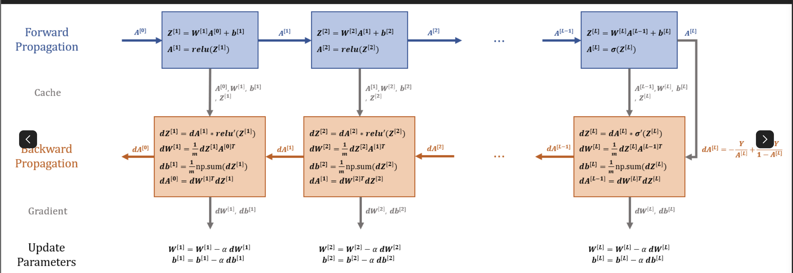

## Intro

신경망은 단순한 퍼셉트론 모델에서 시작하여 점점 깊어질수록 더 복잡한 패턴을 학습할 수 있게 된다.
이전 포스트에서는 두 개의 층을 가진 신경망(2-Layer neural network)를 구현했다. 하지만 현실에서 사용하는 신경망은 더 깊은 층을 가지고 있다.

이번 포스트에서는 L개의 Hidden layer를 가진 신경망을 구현하면서 다음과 같은 내용을 확인하고자 한다.

- 여러개의 층을 갖는 Deep Neural Network(DNN)의 구조
- Forward propagation & Backward propagation 개념 확장
- 다층 신경망에서 Weight, Bias 초기화 및 업데이트
- Relu, sigmoid 등 다양한 활성화 함수 적용

## 1. 파라미터 초기화

L-layer를 가진 신경망을 구현하려면, 각 층의 Weight, bias를 초기화해야 한다.
다음의 함수는 layer_dims를 받아서 각 층의 가중치와 편향을 초기화 하는 함수이다.

```python
def initialize_parameters(layer_dims):
    np.random.seed(1)
    parameters = {}

    L = len(layer_dims)

    for l in range(1,L):
        parameters['W'+str(l)] = np.random.randn(layer_dims[l],layer_dims[l-1]) * 0.01
        parameters['b'+str(l)] = np.zeros((layer_dims[l],1))

    return parameters
```

## 2. Forward Propagation

신경망은 여러개의 층으로 이루어져있고, 입력 -> Linear -> Activation 의 과정을 거친다.

```python
def linear_forward(A, W, b):
    Z = np.dot(A, W) + b
    cache = (A, W, b)

    return Z, cache

def linear_activation_forward(A_prev, W, b, activation):
    if activation == "sigmoid":
        Z, linear_cache = linear_forward(A_prev, W, b) # linear_cache : (A, W, b)
        A, activation_cache = sigmoid(Z) # activation_cache : Z
    if activation == "relu":
        Z, linear_cache = linear_forward(A_prev, W, b)
        A, activation_cache = relu(z)

def L_Model_Forward(X, parameters):
    caches = []
    A = X
    L = len(parameters) // 2

    for l in range(1, L):
        A_prev = A
        A, cache = linear_activation_forward(A_prev, parameters['W' + str(l)], parameters['b' + str(l)], 'relu') # cache : ((A, W, b), Z)
        caches.append(cache)

    AL, cache = inear_activation_forward(A_prev, parameters['W' + str(L)], parameters['b' + str(L)], 'sigmoid')
    caches.append(cache)

    return AL, caches

```

### cache를 사용하는 이유



```python
# 🔴 잘못된 접근 (다시 계산하면 비효율적)
def backward_propagation(dA, W, A_prev, Z):
    dZ = dA * activation_derivative(Z)  # 다시 계산 필요
    dW = np.dot(dZ, A_prev.T) / m  # 다시 계산 필요
    db = np.sum(dZ, axis=1, keepdims=True) / m  # 다시 계산 필요
    return dW, db

# 🟢 올바른 접근 (cache를 활용하면 효율적)
def backward_propagation(dA, cache):
    A_prev, W, b, Z = cache  # Forward에서 저장된 값 불러오기
    dZ = dA * activation_derivative(Z)
    dW = np.dot(dZ, A_prev.T) / m
    db = np.sum(dZ, axis=1, keepdims=True) / m
    return dW, db

```

## Cost 계산하기

딥러닝에서 이진 분류(Binary Classification) 를 수행할 때, 모델의 출력층에서 시그모이드(Sigmoid) 함수가 사용된다.
이 경우, 크로스 엔트로피 비용 함수를 사용하여 모델의 성능을 평가한다.
이 함수는 모델이 예측한 확률값 AL 이 실제 값 Y 와 얼마나 가까운지를 측정한다.

```python
def compute_cost(AL, Y):
    m = Y.shape[1]  # Number of examples

    cost = - (1/m) * np.sum(Y * np.log(AL) + (1 - Y) * np.log(1 - AL))
    cost = np.squeeze(cost)

    return cost

```

## 4. Backward Propagation

신경망이 학습하는 과정에서 손실을 줄이기 위해 가중치(W)와 편향(b)를 조정해야 한다. 역전파(Backward Propagation)를 사용하여 기울기(Gradient)를 구하고, 이를 기반으로 가중치를 업데이트한다.

Backward Propagation 공식 유도는 [이전글](https://soonyubi.github.io/docs/ai/coursera/neural_networks_and_deep_learning_2/#back-propagation)에서 확인할 수 있다.

```python
def sigmoid_backward(dA, activation_cache):
    Z = activation_cache
    s = 1 / (1 + np.exp(-Z))
    dZ = dA * s * (1-s)
    return dZ

def relu_backward(dA, activation_cache):
    Z = activation_cache
    dZ = np.array(dA, copy=True)
    dZ[Z<0] = 0
    return dZ


def linear_activation_backward(dA, cache, activation):
    linear_cache, activation_cache = cache

    if activation == "relu":
        dZ = relu_backward(dA, activation_cache)
        dA_prev, dW, db = linear_backward(dZ, linear_cache)

    elif activation == "sigmoid":
        dZ = sigmoid_backward(dA, activation_cache)
        dA_prev, dW, db = linear_backward(dZ, linear_cache)

    return dA_prev, dW, db

def L_model_backward(AL, Y, caches):

    grads = {}
    L = len(caches)  # Number of layers
    m = AL.shape[1]
    Y = Y.reshape(AL.shape)  # Ensure Y has the same shape as AL


    dAL = - (np.divide(Y, AL) - np.divide(1 - Y, 1 - AL))


    current_cache = caches[L-1]
    dA_prev, dW, db = linear_activation_backward(dAL, current_cache, "sigmoid")

    grads["dA" + str(L-1)] = dA_prev
    grads["dW" + str(L)] = dW
    grads["db" + str(L)] = db


    for l in reversed(range(L-1)):
        current_cache = caches[l]
        dA_prev, dW, db = linear_activation_backward(grads["dA" + str(l+1)], current_cache, "relu")

        grads["dA" + str(l+1)] = dA_prev
        grads["dW" + str(l+1)] = dW
        grads["db" + str(l+1)] = db

    return grads

```

## 5. update parameters

이 함수는 역전파(Backward Propagation)에서 계산된 기울기(Gradient)를 사용하여 가중치(W)와 편향(b)를 업데이트하는 역할을 한다.

신경망이 학습하는 과정에서 손실(Cost)을 줄이려면, 가중치(W)와 편향(b)를 조정해야 한다.
이를 위해 역전파를 수행하여 기울기(Gradient) 를 계산하고, 이를 사용해 가중치를 업데이트하는 것이 update_parameters() 함수의 역할이다.

```python
def update_parameters(parameters, grads, learning_rate):
    L = len(parameters) // 2  # Number of layers in the network

    for l in range(1, L + 1):
        parameters["W" + str(l)] -= learning_rate * grads["dW" + str(l)]
        parameters["b" + str(l)] -= learning_rate * grads["db" + str(l)]

    return parameters
```
