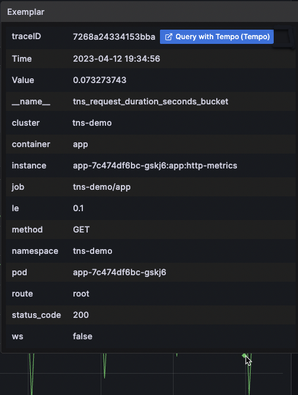
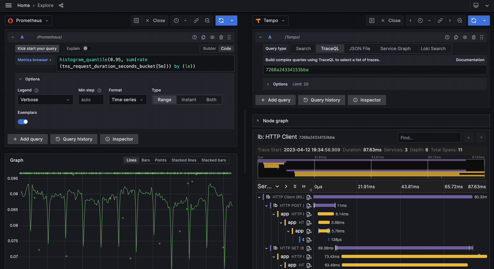
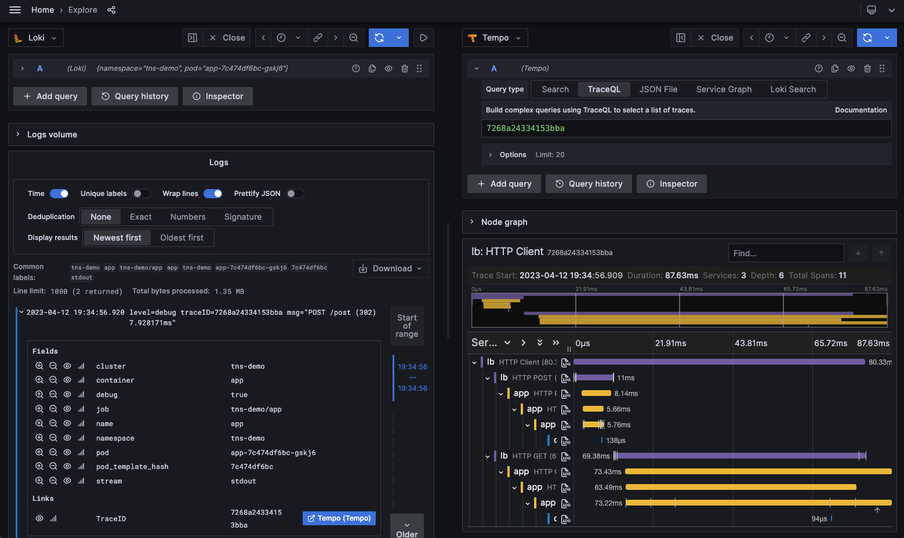

# 개론

이번 포스팅에서는 이러한 LGTM 스택을 활용해  
NestJS 애플리케이션에서 수집한 로그, 메트릭, 트레이스를 **OpenTelemetry SDK를 통해 수집하고,**  
**OTel Collector를 통해 Loki / Tempo / Prometheus로 전송**한 후,  
**Grafana 대시보드에서 모든 데이터를 통합적으로 분석하는 흐름**을 소개합니다.

# LGTM 스택 소개 – Grafana가 밀고 있는 새로운 Observability 흐름

최근 Grafana Labs에서 적극적으로 홍보하고 있는 **LGTM 스택**은 다음 네 가지 오픈소스 프로젝트의 조합을 의미합니다.

- **L**oki: 로그 수집 및 저장소
- **G**rafana: 시각화 도구 및 대시보드
- **T**empo: 분산 추적(트레이싱) 저장소 (APM)
- **M**imir: 시계열 메트릭 저장소

## 왜 grafana는 LGTM 을 밀고 있을까 ?

대부분의 회사에서 **시스템 모니터링, 로깅, APM** 을 위해 다음과 같은 도구들을 사용합니다.

### ✅ 시스템 모니터링

- Prometheus + Grafana
- Zabbix
- Datadog / NewRelic (SaaS)

### ✅ 로그 수집 및 분석

- ELK (Elasticsearch, Logstash, Kibana)
- Loki + Grafana
- CloudWatch
- 기타 SaaS

### ✅ APM (Application Performance Monitoring)

- Scouter
- Elastic APM
- Pinpoint
- Datadog / Instana / etc

이러한 구성은 일반적으로 다음과 같은 문제를 가집니다.

> 📌 **CPU / Memory 등 리소스 상태는 A에서 보고,**  
> 📌 **애플리케이션 로그는 B에서 확인하고,**  
> 📌 **트레이싱/성능 정보는 C에서 확인해야 합니다.**

## LGTM 의 목적

grafana는 이러한 복잡한 관측환경을 grafana라는 대시보드를 통해 하나로 통합하고자 합니다.

## LGTM의 진짜 강점: **관측 데이터 간 연결성**

단일 대시보드에서 보는 것만으로는 부족합니다.  
LGTM은 **로그, 트레이스, 메트릭을 서로 연결**해 다음과 같은 Use Case를 가능하게 합니다:

### 🔍 대표적인 활용 시나리오

1. **Latency가 높은 특정 HTTP 요청 메트릭**에서 해당 트레이스 및 로그 바로 연결 조회
2. **5xx 에러가 발생한 트레이스**에서 관련된 로그 자동 필터링
3. **로그에서 traceId를 클릭해 해당 트레이스를 추적**
4. **트레이스의 특정 Span에 대한 평균 Latency 메트릭 조회**

> 이처럼 **연관된 로그/트레이스/메트릭을 유기적으로 탐색하며 디버깅**할 수 있는 것이 LGTM의 핵심 장점입니다.

### 🎯 LGTM 통합 흐름도

```text
[NestJS App]
   │
   ▼
[OpenTelemetry SDK]
   │
   ├──→ Logs ─────────────┐
   ├──→ Traces ─────────┐ │
   └──→ Metrics ──────┐ │ │
                      ▼ ▼ ▼
               [OpenTelemetry Collector]
                      │
          ┌──────────┼────────────┐
          ▼          ▼            ▼
       [Loki]     [Tempo]     [Mimir]
          └──────────┬────────────┘
                     ▼
                [Grafana UI]
```

# LGTM 구성요소

LGTM을 구성하는 요소는 각기 다른 기능을 수행하지만, 서로 유기적으로 연결되어 하나의 관측파이프라인을 형성합니다.

## Loki : log에서 오류를 찾고 싶을 때

> 🧩 _"500 에러가 났는데, 정확히 어떤 요청에서 났는지 확인하고 싶다."_

이럴 때 사용하는게 로그 저장소인 **Loki** 입니다.
Loki는 시스템이나 어플리케이션에서 발생하는 로그를 수집하고, **필터링 가능한 쿼리(LogQL)**로 분석할 수 있게 해줍니다.

Loki는 log에 `label`을 붙여 저장하고, 로그를 마치 SQL 처럼 질의하여 찾을 수 있도록 합니다.

## Grafana – 모든 걸 한 화면에 연결하고 싶을 때

> 🧩 _“어제 밤에 서비스가 느려졌는데, 메트릭/로그/트레이스 흐름을 한눈에 보고 싶다”_

이럴 때 필요한 게 **Grafana**입니다.  
Grafana는 단순한 시각화 도구가 아니라,  
**로그, 트레이스, 메트릭을 연결해주는 중심 허브**입니다.

- 예: 특정 시간대에 CPU 사용량이 급증한 원인을 로그/트레이스로 따라가본다
- 예: `traceId` 클릭 → 연관된 로그와 서비스 호출 흐름을 바로 확인

Grafana를 쓰면 여러 데이터 소스를 하나의 대시보드에서  
직관적으로 탐색하고, 연결해서 보는 경험이 가능해집니다.

## Tempo – 요청 흐름을 추적하고 싶을 때

> 🧩 _“사용자가 어떤 요청을 보냈을 때, 그 요청이 어떤 서비스 → 어떤 함수 → 어디서 느려졌는지 보고 싶다”_

Tempo는 **분산 트레이싱(Distributed Tracing)** 시스템입니다.  
하나의 요청이 서비스 여러 개를 거쳐 갈 때, 그 흐름을 시각화해서 보여줍니다.

- 예: 사용자 로그인 요청이 `gateway → auth → DB` 를 거치는데  
  → `auth` 단계에서 지연이 발생한 걸 트레이스로 파악
- 예: 에러가 난 요청의 전체 호출 흐름을 확인

Tempo는 traceId 기반으로 로그와도 연결되기 때문에  
**트레이스 ↔ 로그** 간 왕복 탐색도 가능합니다.

## Mimir – 장기 메트릭 데이터를 저장하고 싶을 때

> 🧩 _“CPU 사용률이 최근 3개월간 점점 높아지는 경향이 있는지 보고 싶다”_

Prometheus는 메트릭 수집에는 강하지만,  
**오래 저장하거나 대규모 데이터를 다루는 데 한계**가 있습니다.

이런 문제를 해결하기 위해 등장한 것이 **Mimir**입니다.

- 예: 수천 개의 서버에서 쏟아지는 메트릭을 안정적으로 저장
- 예: 6개월치 메모리 사용량 추이 그래프를 대시보드로 보여주기

Mimir는 Prometheus 쿼리와 완전히 호환되기 때문에,  
기존 Prometheus 환경을 쉽게 확장할 수 있습니다.

## Prometheus – 메트릭을 주기적으로 긁어오고 싶을 때

> 🧩 _“10초마다 서버 CPU, Memory, Disk 사용량을 수집해서 모니터링하고 싶다”_

Prometheus는 **메트릭 수집기**입니다.  
애플리케이션이나 노드에 붙어서 주기적으로 데이터를 수집하고,  
Grafana로 시각화할 수 있습니다.

- 예: `http_requests_total` 같은 애플리케이션 메트릭
- 예: `process_cpu_seconds_total` 같은 시스템 메트릭

Prometheus는 **간단하고 빠르며**, 대부분의 시스템 모니터링에 기본적으로 사용됩니다.

## (optional) OpenTelemetry – 데이터를 수집해서 전달하고 싶을 때

> 🧩 _“NestJS 앱에서 트레이스를 자동으로 수집하고, Collector에 보내고 싶다”_

OpenTelemetry는 **표준화된 수집기**입니다.  
각 언어의 애플리케이션에서 로그/트레이스/메트릭을 수집하고,  
**Collector로 전송하는 역할**을 담당합니다.

- 예: NestJS에서 HTTP 요청마다 trace 정보를 자동으로 수집
- 예: 특정 로직에서 직접 trace span을 추가하거나 로그 emit

OpenTelemetry는 `SDK + Collector` 구조로,  
앱 쪽 코드와 수집기 설정을 분리해서 운영할 수 있다는 장점도 있습니다.

## Use case:

### Latency 가 높게 나온 메트릭을 통해 trace와 log를 한번에 조회하고 싶을 경우

#### 1. Prometheus 메트릭에서 Exemplars 확인

- Prometheus 데이터 소스가 활성화된 상태에서, 메트릭 그래프 상에 **★ 아이콘**으로 Exemplars가 표시됩니다.
- 마우스를 올리면 `traceID`가 나타나고, 옆에 있는 버튼을 클릭하면 Tempo 등 연동된 trace 뷰어로 이동할 수 있습니다.



#### 2. Explore 뷰에서 Trace 분석

- ★ 아이콘을 클릭하면, 해당 trace에 대한 **전체 요청 경로와 span 정보**가 우측 패널에 시각적으로 표시됩니다.
- 예를 들어 요청 처리 중 어느 단계(클라이언트, 어플리케이션, 데이터베이스 등)에서 지연이 발생했는지를 한눈에 파악할 수 있습니다.
- 특정 span을 클릭하면, 해당 요청에 포함된 메타데이터를 자세히 볼 수 있습니다.



#### 3. Loki 로그와 연동

- Loki 로그에 traceID가 포함되어 있다면, `Derived field`를 설정하여 해당 ID를 링크로 만들 수 있습니다.
- 로그 내에서 traceID를 클릭하면 Tempo에서 동일한 요청에 대한 trace 정보를 확인할 수 있습니다.
- 이를 통해 로그 ↔ Trace 간의 원활한 이동이 가능합니다.



- [Grafana 공식 문서 - Exemplars](https://grafana.com/docs/grafana/latest/fundamentals/exemplars/)

### 5xx 오류가 발생한 Trace에서 관련 로그를 함께 조회하고 싶을 때

운영 중인 시스템에서 5xx 오류가 간헐적으로 발생할 때, 단순히 메트릭이나 Trace만 보는 것만으로는 원인을 파악하기 어려운 경우가 많습니다.  
이때 **Trace와 연결된 로그**를 바로 확인할 수 있다면, 훨씬 빠르게 문제의 원인을 파악할 수 있습니다.

Grafana에서는 Tempo + Loki 연동을 통해 **Trace → Logs로 점프(Jump)** 할 수 있는 기능을 지원합니다.

---

#### Grafana에서 Trace → Logs 설정 방법

##### 1. Tempo 데이터 소스 설정

Grafana에서 **Tempo 데이터 소스**를 설정할 때 `tracesToLogs` 구문을 추가합니다.

```yaml
tracesToLogs:
  datasourceUid: "loki_uid"
  tags: ["app", "namespace"]
  spanStartTimeShift: "-5m"
  spanEndTimeShift: "10m"
```

### Trace를 조회하던 중 서비스의 특정 Span에 대한 평균 Latency를 조회하고 싶을 때

운영 중인 서비스를 모니터링하다 보면, **특정 Trace 내 Span이 과도하게 느린 경우**, 그 Span에 대해 평균적인 Latency나 요청 수 등의 메트릭을 추가로 확인하고 싶을 때가 있습니다.

Grafana 9.1부터 새로 도입된 **Trace to Metrics** 기능을 사용하면, Trace에서 바로 관련 메트릭으로 점프할 수 있어 **상황에 대한 맥락을 더 풍부하게 이해**할 수 있습니다.

---

#### Trace to Metrics란?

- Trace의 각 Span에서 해당 서비스나 컨텍스트에 맞는 **메트릭 데이터(Prometheus)** 로 링크를 연결할 수 있는 기능입니다.
- Span의 attribute 값을 기반으로 한 쿼리를 구성해, **해당 Span에 관련된 메트릭 추이**를 바로 확인할 수 있습니다.
- 예를 들어 특정 Pod, Service, Cluster 등과 연관된 `latency`, `error rate`, `request count` 등을 실시간으로 조회할 수 있습니다.

---

#### Trace to Metrics 설정 방법

##### 1. Grafana 설정에서 기능 활성화

Grafana 설정 파일에서 아래 옵션을 추가하여 기능을 활성화합니다.

```ini
[feature_toggles]
enable = ["traceToMetrics"]
```

## 마무리

**다음 포스팅에서는 실제로 NestJS 프로젝트에서 LGTM 스택을 셋업하는 방법을 구체적으로 설명**합니다.
