## Dataframe Basic

- dataframe의 각각의 column은 `series`임
- axis=1은 x축, axis=0는 y축임
- dataframe의 column index는 series의 name과 동일

### properties

- `shape` : (n_row,n_columns)
- `index` : axis=0, RangeIndex
  - df.index -> RangeIndex(start=0,stop=30000,step=1)
- `columns` : axis=1, equals to series names
- `axes` : [index, columns] 꼴
- `dtypes` : 각 column의 type

### creation

```python
df = pd.Dataframe({
  # series_name : array of object
  "id":[1,2],
  "store_nbr":[1,2],
  "family":['POURTRY','PRODUCT']
})

df = pd.read_csv("some_csv_file.csv")

```

[pandas_read_csv_document](https://pandas.pydata.org/docs/reference/api/pandas.read_csv.html)

## Exploring Dataframe

- `head` : get first n rows of df
- `tail` : get last n rows of df
- `sample` : get random sample
  - df.sample(n,random_state) : random_state를 지정해서 같은 랜덤값을 가져올 수 있음
- `info` : column 리스트, 각 column의 type, memory 사용량, index 정보를 가져올 수 있음
  - `show_counts=True` parameter로 non-nullable data의 갯수를 알 수 있음
- `describe` : count / mena / max / 25% / 50% / 75% / min / std 같은 간단한 통계정보를 각각의 column에 대해 구할 수 있음

## Accessing & Dropping Data

### Accessing Data

- dataframe의 각 column은 [] / .(dot) notation 을 통해 접근할 수 있음
- df['some_column']은 series이므로 nunique() / mean() / value_counts() / sum() / round() 같은 메서드를 사용할 수 있음
- multiple column access : [['col1','col2']]
- iloc accessor
- loc accessor
  - df.loc[:,'col1'] 과 df.loc[:,['col1']] 의 결과는 다름, 전자는 series / 후자는 dataframe

### Dropping Data

- df.drop([0],axis=0) &rarr; 0 row를 지운다는 의미
- df.drop(range(5),axis=0) &rarr; 0~4rows를 지운다는 의미

### Identifying Duplicate Data

- df.nunique() : 각 column에 대응하는 데이터 중 unique한 것들의 갯수
  - df_nunique(subset=['col']) 을 통해 원하는 column만 구할 수 있음
- df.duplicated() : row index가 큰 것이 작은 것과 데이터가 동일할 경우 True
  - subset\_['col'] 을 통해 원하는 column만 확인 가능
- df.drop_duplicates() : df.duplicated()가 True인 것들을 제거
  - df.drop_duplicates(subset = 'product', keep='last', ignore_index = True) &rarr; product 컬럼에 대해, 중복은 앞에서 부터 지우며, 중복을 지우고 난 후 row index는 0부터 1씩커지도록 구성하란 의미

## Blank & Duplicate values

- df.isna() : 각 data에 대해 NA면 True
  - df.isna().sum() : 각 column에서 black data 갯수를 구함
- df.fillna() : NA 값을 특정 값으로 채움
- df.dropna() : NA값이 포함된 row를 모두 지움

## sorting & filtering

### filtering

- df.loc[df['col']==='a'] 와 같이 loc 내부 조건에 만족하는 데이터들만 뽑아서 dataframe으로 리턴
- `df.query('family in ['ada','asda'] and sales > 0')`
  - 다음과 같이 변수명을 query 문 안에 쓸 수 있음

```python
avg_sales = df.loc[:,'sales'].mean()

df.query('@avg_sales > 0')
```

### sorting

`sort_index()`를 이용해 dataframe을 index기준으로 sort할 수 있음. axis= 0이 기본값임.

```python
- df.sort_index()
  - axes= 0, row index를 기준으로 sort
- df.sort_index(axis=1)
  - column명을 사전순으로 정렬
- df.sort_index('column1')
  - column1에 들어있는 값을 기준으로 정렬
- df.sort_index(['column1','column2'], inplace=True)
  - column1, column2 기준으로 정렬하고, 해당 데이터프레임 정렬된 것으로 교체
```

## Modifying Columns

### rename columns

df.columns / df.rename() 메서드를 이용해 column 명을 바꿀 수 있음

```python
df.columns = ['a','b','c']
<=>
df.rename(columns={'A':'a','B':'b','C':'c'})

df.columns = [col.upper() for col in df.columns]
<=>
df.rename(columns = lambda x: x.upper())
```

### reordering columns

```python
df.reindex(labels=['column1','column2','column3'])

```

### column creation

```python
df['new_column'] = df['column1'] + df['column2']
df['new_column'] = df['column1'] != df['column2']
```

numpy의 `select`를 이용해 여러개의 조건에 해당하는 새로운 column을 생성할 수 있다.

```python
conditions = [
  df['col1'] != df['col2'],
  df['col2'] != df['col3'],
  df['col3'] != df['col1'],
]
choices = [
  'col1 and col2 are not match',
  'col2 and col3 are not match'
  'col3 and col1 are not match'
]
df['new_column'] = np.select(conditions, choices, default='not in condition')
```

map method를 이용해, 새로운 column의 데이터를 생성할 수 도 있다.
`dataframe['new_column'] = dataframe['col1'].map({'value':'new_value'})`

`df.assign(col1 = df['column1'] + df['column2'])`

## Pandas DataTypes

- bool
  - numpy : boolean True/False, 8bit
  - pandas : nullable boolean True/False, 8bit
- int64
  - numpy : whole numbers, 8/16/32/64 bit
  - pandas : nullable whole number, 8/16/32/64 bit
- float64

  - numpy : whole decimal number, 8/16/32/64 bit
  - pandas : nullable whole decimal number, 32/64 bit

- object

  - numpy : any object
  - pandas
    - string : only string or text
    - category : 반복되는 문자열 같은 것을 숫자에 매핑하여, 메모리 효율을 올림, enum 같은 거

- time series
  - datetime
    - 특정 시각 (e.g. January 4, 2015, 2:00:00 PM)
  - timedelta
    - 2개의 시간 사이의 duration
  - period
    - span of time (a day, a week etc)

## Memory Optimization

dataframe은 메모리에 저장되므로, 메모리 최적화하는 것이 large dataset에 대해 효과적으로 작동함.

`df.memory_usage(deep=True)` 로 메모리양을 확인할 수 있음

1. 필요없는 column은 drop (필요없는 column을 읽는 것도 피하는 것이 좋음)
2. datatype을 가능하다면, int64 / datetime으로 변환
3. 숫자가 어디까지 커질 지 미리 예상해서, 숫자 타입을 downcasting
4. category로 분류할 수 있는 데이터는 categorical datatype으로 지정

- `df.astype({'column':'category'})`

## Grouping Columns

### Aggregate dataframe

series처럼 dataframe에도 aggregate 관련함수를 사용할 수 있다.

```python
df.loc[,['column1','column2']].sample(100).sum().round(2)
df.loc[,['column1','column2']].sample(100).mean().round(2)
```

여러개의 column을 각각 aggregate 하거나, column을 grouping 하고 aggregate하고 싶다면? -> `df.groupby()`

```python
df.groupby(['col1','col2'])[['col3','col4']].sum()
-->col1,col2순서로 데이터를 그룹지어서 [column3,column4] 에 해당하는 sum을 구할 수 있음.
--> 이때 col1,col2는 multi-index임
--> multi-index를 풀려면 다음과 같이 as_index라는 argument를 groupby에 전달해주면 됨
df.groupby(['col1','col2'], as_index = False)[['col3','col4']].sum()


```

## multi-index

multi-index는 aggregate function을 통해 생기는 index임. tuple list로 저장됨

<p align='center'>
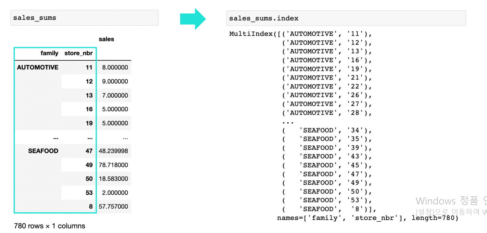
</p>

multi-index를 접근하는 방법은 기존 dataframe과 차이가 있음.
loc[] accessor를 통해 접근하는데 다음과 같이 작동함.

<p align='center'>

</p>
<p align='center'>

</p>

### modifying multi-index

<p align='center'>

</p>

### Aggregating Group

grouping 된 dataframe에는 `agg()` 메서드를 사용해, 집계함수를 적용할 수 있다.

```python
df.groupby(['store_nbr','family']).agg('sum')
df.groupby(['store_nbr','family']).agg(['sum','mean'])
```

<p align='center'>
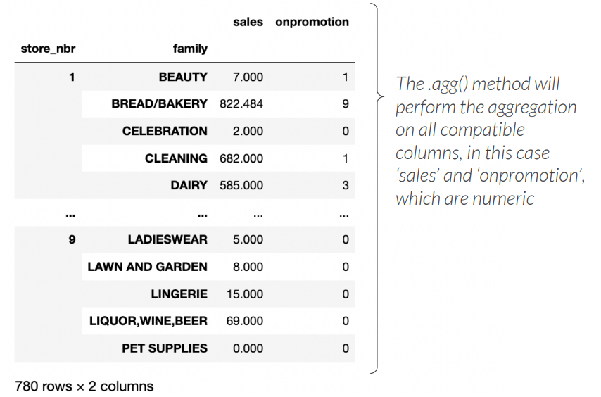

</p>

이렇게 grouping 된 dataframe에 agg 메서드를 적용해서 각각의 집계함수를 구할 수도 있다. 하지만 위 그림에서 보이는 것과 같이, 2개의 level로 이루어진 column을 생성하므로 직관적이지 않다. 다음은 1개의 level 이루어져있고, column의 이름을 지정하는 방법이다.

```python
df.groupby(['store_nbr','family']).agg(
  sales_sum = ('sales','sum'),
  sales_avg = ('sales','avg'),
  on_promotion_max = ('promotion','max')
)
```

<p align='center'>
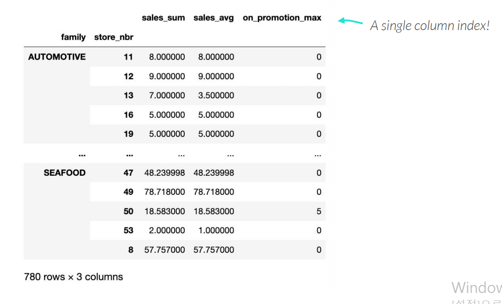
</p>

transform 메서드를 이용해서, dataframe을 reshaping 하지 않고 aggregate function 을 적용할 수 있다.

```python
df.assign(new_column = (
  df.groupby('column')['another_column'].transform('sum')
))
```

## Pivot Table

### arguments

- `index` : returns row index with `distinct` values from the specified in columns
- `columns` : return column index with `distinct` values from the specified in columns
- `values` : to perform on aggregation on
- `aggfunc` : aggreagte function to perform on the values
- `margins` : return row and column total (default is False)

```python
smaller_retail.pivot(
  index = 'family',
  columns = 'store_nbr',
  values = 'sales',
  aggfunc = 'sum',
  margins = True
)
# this means select distinct values on store_nbr column as column index, and select distinct values on family column as row index and apply sum to sales column
```

<p align='center'>
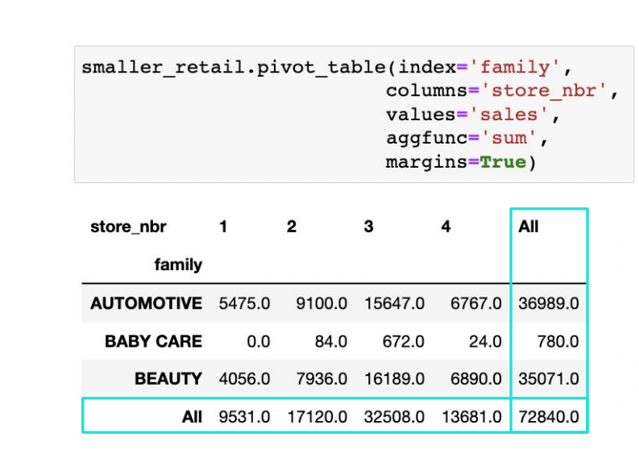
</p>

```python
# multiple aggregation
smaller_retail.pivot(
  index='family'
  columns = 'store_nbr'
  values = 'sales'
  aggfunc = ('min','max') # this is tuple ! ! !
)
smaller_retail.pivot(
  index ='family'
  columns = 'store_nbr'
  values = 'sales'
  aggfunc = ({'promotion':'max','sales':['mean','sum']})
)
```

<p align='center'>
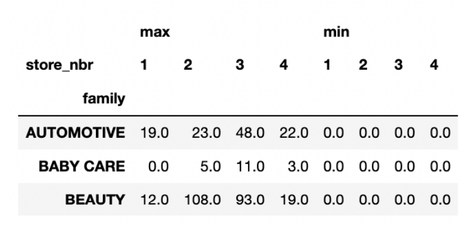
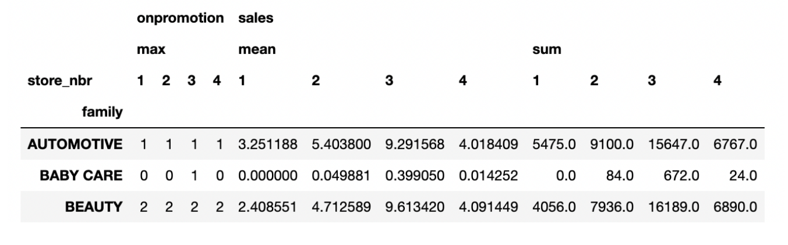
</p>

### pivot table vs groupby

pivot table은 2개의 level로 이루어진 dataframe을 생성하는데, column이 필요없다면, `groupby().agg(new_column = ())` 을 이용하면 된다.

### heatmap

dataframe을 좀 더 시각화하고 싶다면, `df.style.background_gradient(cmap = 'RdYlGn', axis=?)` 으로 스타일을 적용하면 된다.

### melt

<p align='center'>
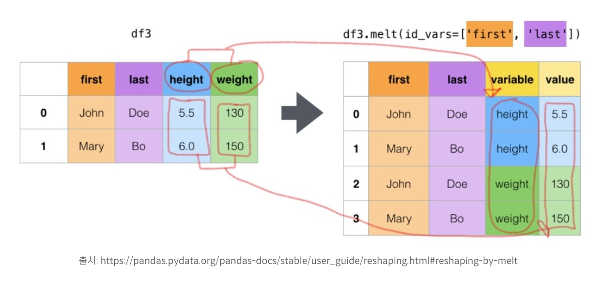

</p>

## Importing & Exporting Data

### preprocessing options

`read_csv`

- file ='path/name.csv' : file path or url
- sep = '/' : 구분자, (default : ,)
- header = 0 : column names을 어느 row로 쓸지, (default : 'infer')
- names = ['column1','column2'] : column명을 어떻게 할 지, 만약 names의 길이가 더 길다면, `NaN`으로 필드를 채움
- index_col = 'date' : index column을 date로 함
- usecols = ['column1','column2'] : dataframe으로 변환할 때 어떤 column 만 쓸지
- dtype = {'date' : "datetime64","sales" : "Int32"} : 형변환
- parse_dates = True : True일 경우 date string을 datetime으로 변환
- infer_datetime_format = True : date를 datetime 64로 변환해서 date parsing을 더 빠르게 함
- na_values = ["-","#N/A!"] : NaN으로 처리할 string 값들
- nrows = 가져올 데이터 갯수
- skip_rows = [0,2] : 지울 line number
- converters = {"sales",lambda function} : sales column에 lambda 적용

---

```python
pd.read_csv("monthly_sales.csv").head(3) # infer the column names in files
```

<p align='center'>
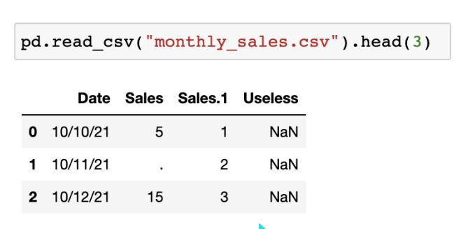
</p>

```python
pd.read_csv("monthly_sales.csv",header=None).head(3) # use column as integers
```

<p align='center'>
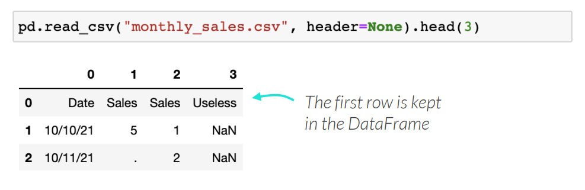
</p>

```python
cols = ['Date', 'Grocery Sales', 'Beverage Sales', 'to_drop']

pd.read_csv('monthly_sales.csv', header = 0, names= cols).head(3)
```

<p align='center'>
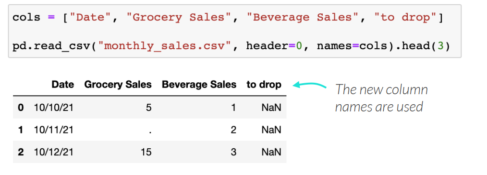

</p>

```python
pd.read_csv("monthly_sales.csv", index_col ="Date")
```

위와 같이 index를 Date column으로 세팅하게되면, column을 multi-index 로 생성하기 때문에 추천되는 방식은 아니다.

## Read .txt files

### read tap separated files

```python
pd.read_csv("tap_separated.txt", sep = '/t')
```

### read xlsx files

```python
pd.read_csv("monthly_sales.xlsx" , sheet_name = 1)
```

위와 같이 sheet name을 지정할 수 있다.

```python
all_sales = pd.concat(
  pd.read_csv("monthly_sales.xlsx",sheet_name=None),
  ignore_index = True
)
```

- sheet_name = None : pandas가 모든 sheet을 읽어서 dictionary로 저장한다.
- ignore_index = True : 각각의 row가 unique한 index를 가지도록 한다.

### export dataframe to flat files(csv, txt, xlsx ...)

```python
my_df.to_csv("cleaned_data.csv") # cleaned_data.csv
my_df.to_csv("cleaned_data.csv",sep='/t') # cleaned_data.txt
my_def.to_excel("cleaned_data.csv", sheet_name='october sales') # cleaned_data.xlsx
```

## Connecting to SQL Database

```python
from sqlalchemy import create_engine, inspect

engine = create_engine('db_host') # database connection
inspect(engine).get_table_names() # view database contents
```

### read sql

```python

league_df = pd.read_sql("select * from league", engine)
```

### write sql

```python
from sqlalchemy.types import Integer

premier_league_games.to_sql(
  name ='pl_games' # define table name
  con = engine, # database engine
  if_exists = 'append' # if table already exist append rows
  index = False # leaving default index
  dtype = {"HomeGoals" : Integer()}
)

```

### additional format

<p align='center'>
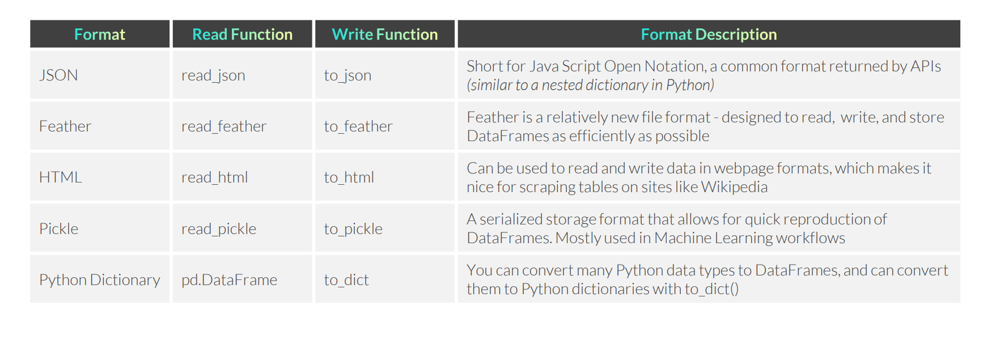

</p>

## Combining Dataframes

### Appending

`concat` 메서드를 사용해 여러개의 dataframe을 붙일 수 있다. 이 때 여러개의 dataframe의 column은 무조건 **동일**해야한다.

```python
# all dataframe must has identical columns
pd.concat([dataframe1, dataframe2,dataframe3])
```

### Joining

`merge` 메서드를 사용해 두 개의 dataframe을 join 할 수 있다. 이 때 두 개의 dataframe은 무조건 공유하는 하나 이상의 column을 가져야 한다.

```python
left_df.merge(
  right_df,
  how, # type of join
  left_on, # left_df 에서 join에 참여할 column
  right_on # right_df 에서 join에 참여할 column
 )
```

- join types
  - `inner`
  - `left`
  - `right`
  - `outer`

`join` 메서드는 두개의 dataframe 을 index를 이용해 join한다.

```python
item_sales_short.join(transactions_short, rsuffix = '2)

```
